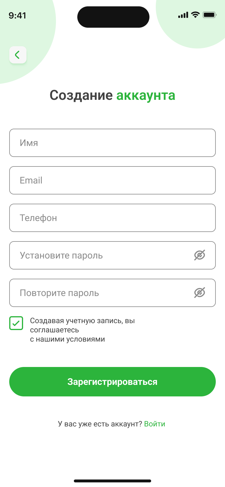
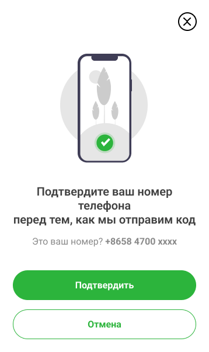
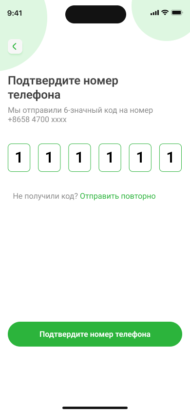
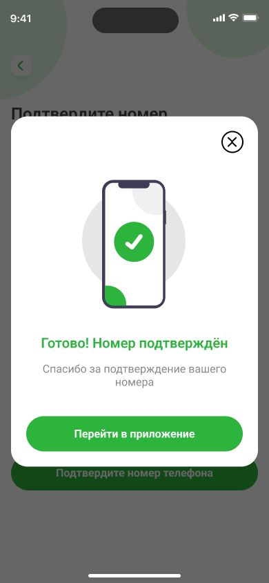

# Регистрация в Nova Bank

Для регистрации в Nova Bank необходимы электронная почта и номер мобильного телефона.

## Регистрация

1. На главном экране приложения Nova Bank нажмите **Регистрация**.  
2. Заполните необходимые данные: имя, адрес электронной почты, номер мобильного телефона.
3. Придумайте пароль
4. Нажмите **Зарегистрироваться**.

5. Нажмите **Подтвердить**.  
На указанный номер мобильного телефона придет SMS с кодом подтверждения.  

6. Введите полученный код из SMS и нажмите **Подтвердить номер телефона**.

После успешной регистрации вы сможете войти в личный кабинет, используя номер телефона или электронную почту вместе с установленным паролем.

# Авторизация через Госуслуги в Nova Bank

Вы можете авторизоваться в Nova Bank через Госуслуги:

1. Нажмите на иконку Nova Bank на главном экране вашего устройства.
2. Выберите **Войти в аккаунт**.
3. Нажмите на значок меню и выберите **Госуслуги**.
4. Введите свои учётные данные для Госуслуг и проверьте их актуальность.
5. Нажмите **Войти**.
6. На ваш номер придёт SMS с кодом подтверждения.
7. Введите код и нажмите **Продолжить**.
8. При необходимости введите пароль от вашего аккаунта или подтвердите вход через push-уведомление.
9. Нажмите **Продолжить** для завершения авторизации.

**Читайте также:**

- [Как перевести деньги по номеру карты](../payments/transfers.mdx)
- [Просмотр баланса и транзакций](../balance.mdx) 
- [Как восстановить пароль в Nova Bank](change-password.mdx)
