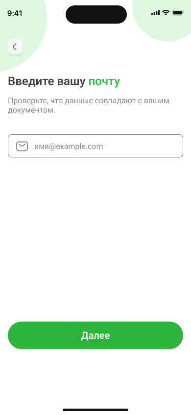
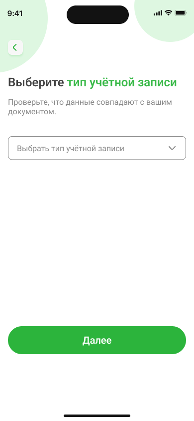
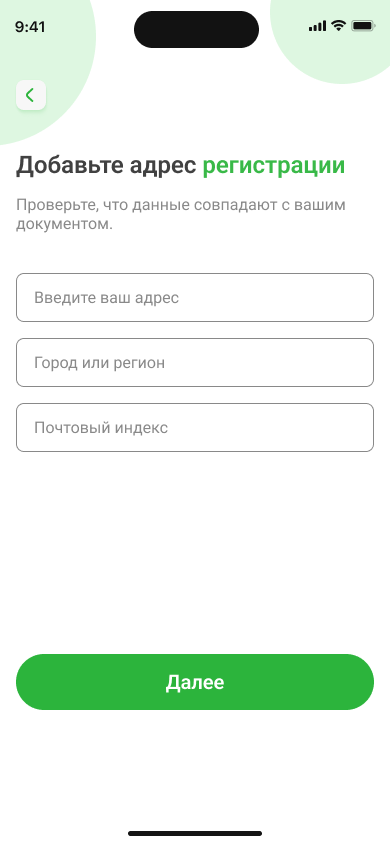
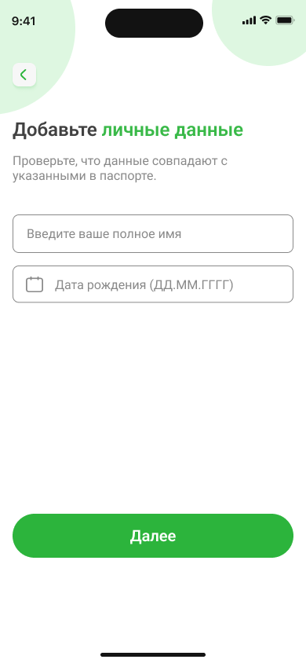

# Как настроить аккаунт в приложении NovaBank

1. Перейдите в раздел **Профиль**.  
2. Нажмите **Редактировать**.  
3. Введите адрес электронной почты.  
Нажмите **Далее**.  

&nbsp;&nbsp;&nbsp;&nbsp;&nbsp;&nbsp;
  

2. Выберите тип учетной записи.  
Нажмите **Далее**.  

&nbsp;&nbsp;&nbsp;&nbsp;&nbsp;&nbsp;
    

3. Добавьте адрес регистрации: адрес, город или регион, индекс.  
Нажмите **Далее**.  

&nbsp;&nbsp;&nbsp;&nbsp;&nbsp;&nbsp;
    

4. Введите полное имя.  
Нажмите на поле **Дата рождения**, выберите дату в календаре.  
Нажмите **Далее**.  

&nbsp;&nbsp;&nbsp;&nbsp;&nbsp;&nbsp;
    

